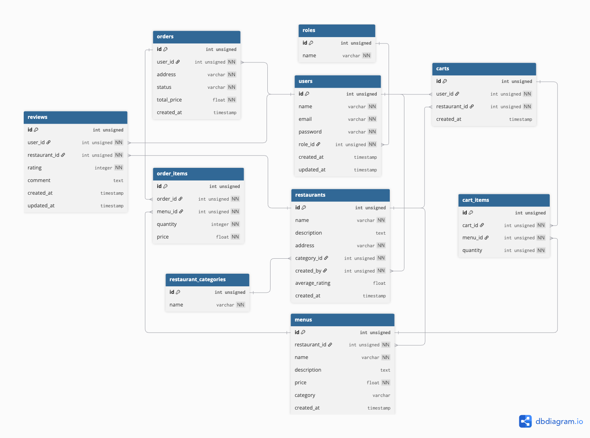

# Food API

REST API food delivery system built with Golang — simulating platforms like GoFood/GrabFood.

## Tech Stack

- **Golang + Gin** — HTTP framework
- **MySQL + GORM** — database & ORM
- **Redis** — caching
- **JWT** — authentication
- **Docker** — containerization

---

## Getting Started

**1. Clone & setup environment**
```bash
git clone https://github.com/mariorinawan12/food-api.git
cd food-api
cp .env.example .env
```

**2. Run with Docker**
```bash
docker compose up -d
```

Server runs at `http://localhost:8080`

> Database tables are created automatically on first run via GORM AutoMigrate.

---

## Default Account

| Role | Email | Password |
|------|-------|----------|
| Super Admin | superadmin@mail.com | password |

Register new accounts via `POST /api/register` with role `user` or `restaurant_admin`.

---

## Roles

| Role | Access |
|------|--------|
| `user` | Browse restaurants & menus, manage cart, place & pay orders, write reviews |
| `restaurant_admin` | Manage own restaurants & menus, process & deliver incoming orders |
| `super_admin` | View all users & orders |

---

## Order Flow

```
payment_pending → paid → processing → delivered
payment_pending → cancelled
```

| Transition | Actor |
|------------|-------|
| `payment_pending` → `paid` | User |
| `payment_pending` → `cancelled` | User |
| `paid` → `processing` | Restaurant Admin |
| `processing` → `delivered` | Restaurant Admin |

---


---

## Project Structure

```
food-api/
├── cmd/
│   └── api/
│       └── main.go              # Entry point
├── config/
│   └── config.go                # DB, Redis init & migration
├── internal/
│   ├── domain/                  # Entity structs (shared across features)
│   │   ├── user.go
│   │   ├── restaurant.go
│   │   ├── menu.go
│   │   ├── cart.go
│   │   ├── order.go
│   │   └── review.go
│   ├── helper/                  # Shared utilities
│   │   ├── jwt.go
│   │   ├── hash.go
│   │   └── response.go
│   ├── middleware/              # Gin middlewares
│   │   └── auth.go
│   ├── router/                  # Route definitions
│   │   └── router.go
│   ├── auth/                    # Authentication feature
│   │   ├── handler.go
│   │   ├── usecase.go
│   │   ├── repository.go
│   │   └── dto.go
│   ├── restaurant/              # Restaurant feature
│   │   ├── handler.go
│   │   ├── usecase.go
│   │   ├── repository.go
│   │   └── dto.go
│   ├── menu/                    # Menu feature
│   │   ├── handler.go
│   │   ├── usecase.go
│   │   ├── repository.go
│   │   └── dto.go
│   ├── cart/                    # Cart feature
│   │   ├── handler.go
│   │   ├── usecase.go
│   │   ├── repository.go
│   │   └── dto.go
│   ├── order/                   # Order feature
│   │   ├── handler.go
│   │   ├── usecase.go
│   │   ├── repository.go
│   │   └── dto.go
│   └── review/                  # Review feature
│       ├── handler.go
│       ├── usecase.go
│       ├── repository.go
│       └── dto.go
├── Dockerfile
├── docker-compose.yml
└── .env.example
```

---

## Database ERD



---

## Folder Descriptions

### `cmd/api`
Entry point. Initializes DB, Redis, runs migration, then starts the HTTP server.

### `config`
- `InitDB()` — connects to MySQL via GORM
- `InitRedis()` — connects to Redis
- `RunMigration()` — auto migrates all tables + seeds default data (roles, super admin, restaurant categories)

### `internal/domain`
Shared entity structs used across all features.

### `internal/helper`
Shared utilities used across all features:
- `jwt.go` — `GenerateToken()` and `ValidateToken()` using HMAC HS256
- `hash.go` — `HashPassword()` (bcrypt) and `CheckPassword()`
- `response.go` — `Success()` and `Error()` for standardized JSON responses

### `internal/middleware`
Gin middlewares for authentication and authorization:
- `AuthMiddleware()` — validates JWT token, injects `user_id` and `role` into context
- `UserOnly()` — allows only `user` role
- `RestaurantAdminOnly()` — allows only `restaurant_admin` role
- `SuperAdminOnly()` — allows only `super_admin` role

### `internal/router`
Registers all routes grouped by access level: public, user, restaurant_admin, super_admin. Initializes all repositories, usecases, and handlers.

### `internal/auth`
Handles registration, login, and user listing.
- `handler.go` — HTTP layer for register, login, get all users
- `usecase.go` — password hashing, JWT generation, credential validation
- `repository.go` — queries `users` and `roles` tables
- `dto.go` — RegisterRequest, LoginRequest, LoginResponse, UserResponse

### `internal/restaurant`
Manages restaurant CRUD with ownership validation.
- `handler.go` — CRUD endpoints + get my restaurants
- `usecase.go` — ownership validation (restaurant_admin can only edit own restaurants)
- `repository.go` — queries `restaurants` table with **Redis caching** on FindAll & FindByID
- `dto.go` — CreateRequest, UpdateRequest, RestaurantResponse

### `internal/menu`
Manages menu CRUD with ownership validation via restaurant.
- `handler.go` — CRUD endpoints + list menus by restaurant
- `usecase.go` — validates menu ownership via restaurant's `created_by`
- `repository.go` — queries `menus` table with **Redis caching** on FindAll & FindByID
- `dto.go` — CreateRequest, UpdateRequest, MenuResponse

### `internal/cart`
Manages shopping cart with restaurant isolation.
- `handler.go` — CRUD cart, add/update/delete items, checkout
- `usecase.go` — enforces 1 cart per restaurant per user, validates menu belongs to cart's restaurant
- `repository.go` — queries `carts` and `cart_items` tables
- `dto.go` — CreateCartRequest, AddItemRequest, UpdateItemRequest, CartResponse

### `internal/order`
Manages the full order lifecycle.
- `handler.go` — checkout, list orders, pay, cancel, process, deliver
- `usecase.go` — state machine for order status, ownership validation, price snapshot at checkout
- `repository.go` — queries `orders` and `order_items`, validates order ownership by restaurant admin
- `dto.go` — CheckoutRequest, OrderResponse, OrderItemResponse

### `internal/review`
Manages restaurant reviews and auto-updates average rating.
- `handler.go` — CRUD review per restaurant
- `usecase.go` — validates user has a delivered order at the restaurant, enforces 1 review per user per restaurant
- `repository.go` — queries `reviews`, updates `average_rating` on restaurants, invalidates Redis cache on changes
- `dto.go` — CreateRequest, UpdateRequest, ReviewResponse

---

## Architecture Flow

```
HTTP Request
     │
     ▼
  Handler        ← parse & validate request, return response
     │
     ▼
  Usecase        ← business logic & rules
     │
     ▼
 Repository      ← database & cache queries
     │
     ▼
  MySQL / Redis
```
